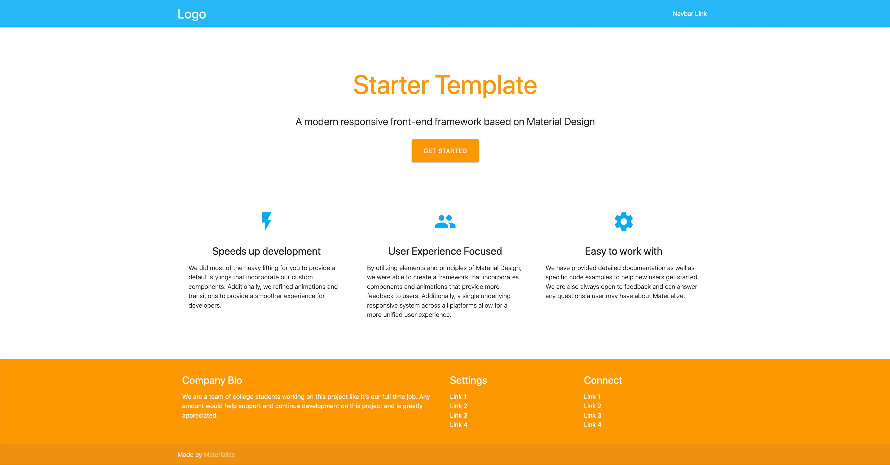

## What is Material Design?

Material Design is a design language created by Google. According to material.io, Material Design aims to combine:

> …classic principles of good design with the innovation and possibility of technology and science. It aims to develop a single underlying system that allows for a unified experience across platforms and device sizes. Mobile precepts are fundamental, but touch, voice, mouse, and keyboard are all first-class input methods.

## Why use Material Design?

Material Design provides a seamless user experience across all devices. Responsive transitions and animation, along with padding and depth effects such as shadows and lightning, make it feel elegant and user-friendly. Google uses Material Design on almost all its apps (like Keep and Calendar).

## How can you use Material Design in your web apps?

Materialize is a responsive front-end component library similar to Bootstrap. It offers everything that Bootstrap has to offer, but the difference is that Materialize follows material design principles. Here’s an example template.



## Here’s a list of features that Materialize offers:

- Grid
- Tables
- Badges, buttons, breadcrumbs
- Cards, chips, collections
- Footer, forms
- Navbar
- And a lot more!

## How to get started

Unlike Bootstrap, Materialize does not require popper.js. It only requires jQuery. This is all you need to get started. Add this to your HTML and you’ll be good to go!

```html
<!-- Compiled and minified CSS -->
<link
  rel="stylesheet"
  href="https://cdnjs.cloudflare.com/ajax/libs/materialize/0.100.2/css/materialize.min.css"
/>

<!--Compiled and minifed jQuery -->
<script
  type="text/javascript"
  src="https://code.jquery.com/jquery-3.2.1.min.js"
></script>

<!-- Compiled and minified JavaScript -->
<script src="https://cdnjs.cloudflare.com/ajax/libs/materialize/0.100.2/js/materialize.min.js"></script>
```

## Colors

Using Materialize, you can change the color of any HTML element by simply giving it a class name of the color you want. For example, if you want to give your paragraph tag the color red, you do the following:

```html
<p class="red">Lorem Ipsum</p>
```

Additionally, you can also lighten or darken a color by giving it another class name lighten-1 or darken-1. For example, <h1 class=”blue lighten-1”>Sample Text</h1>. The 1 can be replaced with numbers up to 5 for lighten and up to 4 for darken. Higher numbers would apply lighter or darker shades of the color.

## Buttons

To Materialize a button, just give it the class name btn. You can also add a cool animation to it by giving it another class waves-effect. If you need a larger button, btn-large class can be used. For example:

```html
<!-- Materialized button without click animation -->
<button class="”btn”">
  Click
</button>

<!-- Materialized button with click animation -->
<button class="btn waves-effect">
  Click
</button>

<!-- Large Button -->
<button class="btn-large">
  Click
</button>
```

## Shadow

> In material design, everything should have a certain z-depth that determines how far raised or close to the page the element is.

To apply a shadow-effect to an element, the z-depth-2 class can be used (2 can be replaced with numbers 1–5). For example:

```html
<div class="z-depth-2"><!-- Really cool stuff --></div>
```

## Conclusion

I’ve only scratched the surface here. There is a lot more available in Materialize (like transitions, cards, carousel, and modals). You can learn how to use all the components from the <a href="https://materializecss.com/getting-started.html" target="_blank" rel="noreferrer">docs</a>. Class names are very simple and the grid is really helpful to create responsive columns quickly. I wish you good luck!
